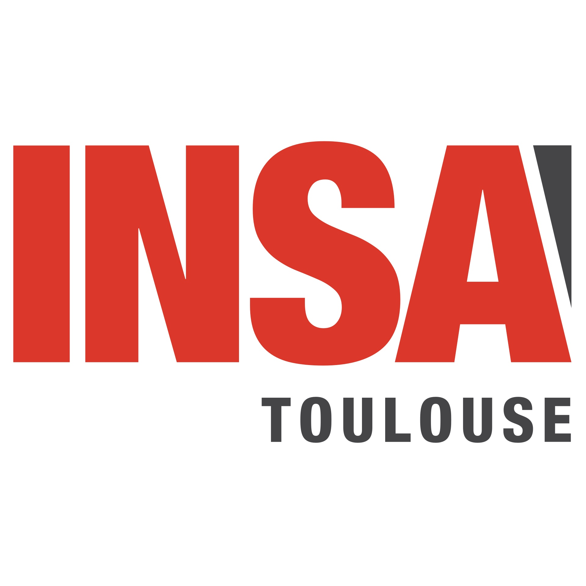

<div style="display: flex; align-items: center; justify-content: center; gap: 2rem; margin-bottom: 1rem;">
  
  
</div>

Welcome to the **Advanced AI** ModIA course page!

This course will give students the basis to understand modern AI systems, with a focus on implementation and applications. The course is structured around:

- Lectures
- Practical programming sessions 
- One project that will start mid-semester.

In this course, you will learn about modern LLMs, VLMs, Self-Supervised Learning, and Reinforcement Learning involved in LLM training. 

This page is the main hub for the course. You will find lecture notes, practical programming and project guidelines, and related code. This is the first year this course is given, so expect some changes and updates along the way. See [below](#repository-setup) for how to update your local repository with the latest changes.


## Repository Setup

First fork this repository to your own GitHub account, then clone it locally

```bash
git clone your_forked_URL
```

Then add this repo as a remote to pull updates

```bash
git remote add upstream https://github.com/paulnovello/Advanced-AI
```

To update your forked repo with the latest changes from this original repo, run:

```bash
git fetch upstream
git merge upstream/main
```

If you only make changes to the files specified in the practical programming sessions, you should never have merge conflict to manaually resolve. If you do, just reach out to the course staff.

## Environment Setup

### 1. Install uv

We recomend to set up the environment once and for all with [uv](https://docs.astral.sh/uv/). Uv is a fast Python package installer and resolver. Install it using one of the following methods:

**macOS/Linux:**
```bash
curl -LsSf https://astral.sh/uv/install.sh | sh
```

**Windows:**
```powershell
powershell -c "irm https://astral.sh/uv/install.ps1 | iex"
```

**Using pip:**
```bash
pip install uv
```

### 2. Create env

```bash
uv env ./aai_env
```


### 3. Install Dependencies

Install the required dependencies using uv:

```bash
uv sync --group student
```

### 4. Activate env

Activate the virtual environment created by uv:

```bash
source ./aai_env/bin/activate  # macOS/Linux
```
or
```bash
.\aai_env\Scripts\activate    # Windows
```

or use uv's run command to execute scripts within the environment without activating it:

```bash
uv run python # my_script.py
```